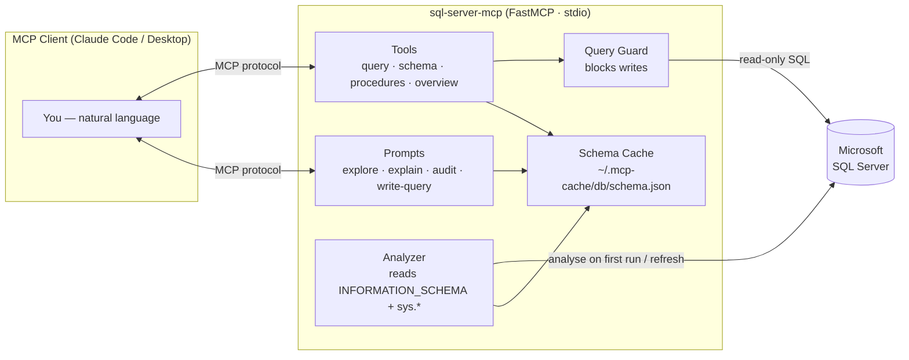
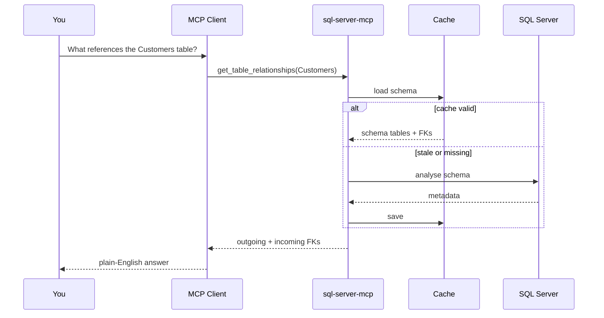

# SQL Server MCP

> A [Model Context Protocol](https://modelcontextprotocol.io) server that connects Claude (and any MCP-compatible client) to Microsoft SQL Server — **read-only, safe, and schema-aware**.

<p>
  
  
  
  
</p>

Share the code with your team; **each user brings their own database credentials**. On first run the server auto-analyses the database (tables, columns, stored procedures, foreign keys, row counts) and caches the schema locally, so the model gets rich context without repeatedly hammering the DB.

---

## Table of Contents

- [Why](#why)
- [Features](#features)
- [Architecture](#architecture)
- [How a request flows](#how-a-request-flows)
- [Quick Start](#quick-start)
- [Use cases](#use-cases)
- [Tools](#tools)
- [Prompts](#prompts)
- [Configuration](#configuration)
- [Security model](#security-model)
- [Development](#development)
- [License](#license)

---

## Why

LLMs are great at writing SQL but terrible at guessing your schema. Pasting DDL by hand is tedious and goes stale. This server gives the model a **live, cached, structured view** of your database and a set of **safe, read-only tools** to explore it — so you can just ask questions in plain English:

> *"Which tables reference the `Customers` table?"*
> *"Find stored procedures related to invoicing."*
> *"Write me a query for the top 10 orders by value this month."*

---

## Features

- 🔒 **Read-only by design** — `INSERT` / `UPDATE` / `DELETE` / `DROP` / `ALTER` / `TRUNCATE` / `MERGE` / `EXEC` are blocked at the query layer, and stored procedures are scanned for write operations before execution.
- 🧠 **Schema-aware** — auto-analyses tables, columns, PKs, FKs, and stored procedures; the model always has context.
- ⚡ **Fast** — schema is cached to `~/.mcp-cache/<db-name>/schema.json` and loads in ~50 ms on subsequent startups. Auto-refreshes every 24 h (configurable).
- 🧭 **Relationship mapping** — see both what a table references *and* what references it.
- 🧩 **Module detection** — groups stored procedures by naming-convention prefix (e.g. `usp_Invoice_*` → `Invoice`).
- 🪄 **One-command setup wizard** — prompts for credentials, tests the connection, and registers the MCP for you.
- 🔑 **Bring-your-own-credentials** — no shared secrets; each user stores their own locally.

---

## Architecture



**Package layout**

```
src/sql_server_mcp/
├── __main__.py          # CLI entry point: `sql-server-mcp` / `sql-server-mcp setup`
├── server.py            # FastMCP app — registers all tools & prompts
├── setup.py             # Interactive setup wizard
├── db.py                # Connection pooling + read-only query guard
├── analyzer.py          # Introspects the DB into a schema dict
├── cache.py             # Read/write/TTL for the local schema cache
├── tools/
│   ├── query.py         # run_read_only_sql
│   ├── schema.py        # tables, columns, relationships, samples
│   ├── procedures.py    # list/search/define/execute stored procedures
│   └── overview.py      # db overview + cache refresh
└── prompts/
    └── definitions.py   # pre-built conversation starters w/ injected context
```

---

## How a request flows



---

## Quick Start

### Prerequisites

- Python 3.10+
- [ODBC Driver 17 or 18 for SQL Server](https://learn.microsoft.com/sql/connect/odbc/download-odbc-driver-for-sql-server)
- An MCP client (e.g. Claude Code CLI)

### 1. Install

```bash
pip install git+https://github.com/KULDIP-1662/sql-server-mcp.git
```

### 2. Run the setup wizard

```bash
sql-server-mcp setup
```

The wizard asks for your DB credentials, tests the connection, and registers the MCP automatically:

```text
  SQL Server MCP — Setup Wizard
  ───────────────────────────────────
  DB Server  : localhost\SQLEXPRESS
  DB Name    : AdventureWorks
  DB User    : app_reader
  DB Password: ********
  MCP alias  : my-db

  Testing connection... ✓ Connected using 'ODBC Driver 17 for SQL Server'
  Credentials saved to C:\Users\you\.sql-server-mcp.json
  Registering MCP as 'my-db'... ✓ Done!

  ✓ Restart your MCP client and you're ready to use 'my-db'.
```

### 3. Restart your client and start asking

> *"Give me an overview of the database"*
> *"Find stored procedures related to invoicing"*
> *"Show me the schema of the `Customers` table"*
> *"What tables reference the `Products` table?"*

---

## Use cases

| Scenario | What you ask | Tools involved |
|----------|--------------|----------------|
| **Onboarding to a new DB** | *"Give me an overview and the largest tables."* | `get_db_overview`, `explore_database` |
| **Impact analysis before a change** | *"What references the `Orders` table?"* | `get_table_relationships` |
| **Finding the right stored procedure** | *"Which SPs deal with shipping?"* | `search_sps_by_name`, `find_sp_for_feature` |
| **Understanding a table** | *"Explain the `Invoices` table."* | `explain_table`, `get_table_schema` |
| **Ad-hoc reporting** | *"Top 10 customers by total spend."* | `write_query_for`, `run_read_only_sql` |
| **Change auditing** | *"Which stored procedures changed this week?"* | `sp_audit`, `list_stored_procedures` |
| **Safe data sampling** | *"Show me 5 sample rows from `Products`."* | `get_table_sample_data` |

---

## Tools

| Tool | Description |
|------|-------------|
| `get_db_overview` | Table/SP counts, modules, largest tables, recently changed SPs |
| `run_read_only_sql` | Execute any `SELECT` query (writes blocked) |
| `list_tables` | Browse all tables with row counts |
| `get_table_schema` | Columns, types, PKs, FKs for a table |
| `get_table_relationships` | What a table references and what references it |
| `search_tables_by_name` | Find tables by keyword |
| `get_table_sample_data` | See top N rows from a table (max 50) |
| `list_stored_procedures` | Browse SPs, filter by name or module |
| `search_sps_by_name` | Find SPs by keyword |
| `get_sp_definition` | Full SQL definition of an SP |
| `execute_sp` | Run a read-only SP with optional params |
| `refresh_schema_cache` | Force re-analyze DB and rebuild cache |

---

## Prompts

Built-in conversation starters that inject schema context:

| Prompt | Description |
|--------|-------------|
| `explore_database` | Full overview of the connected database |
| `find_sp_for_feature` | Find SPs related to a feature keyword |
| `explain_table` | Understand a table's structure and relationships |
| `write_query_for` | Get help writing a SQL query |
| `sp_audit` | See recently modified stored procedures |

---

## Configuration

Credentials are read from **environment variables first**, then from `~/.sql-server-mcp.json`.

### Option A — setup wizard (recommended)

```bash
sql-server-mcp setup
```

### Option B — environment variables (at registration)

```bash
claude mcp add my-db sql-server-mcp \
  --env DB_SERVER=your-server \
  --env DB_NAME=your-database \
  --env DB_USER=your-user \
  --env DB_PASSWORD=your-password
```

### Option C — config file (`~/.sql-server-mcp.json`)

```json
{
  "server": "your-server",
  "database": "your-database",
  "user": "your-user",
  "password": "your-password"
}
```

Then register with no env flags:

```bash
claude mcp add my-db sql-server-mcp
```

### Optional settings

| Env var | Default | Description |
|---------|---------|-------------|
| `DB_DRIVER` | auto-detected | ODBC driver name |
| `DB_PORT` | `1433` | SQL Server port |
| `CACHE_TTL_HOURS` | `24` | Hours before re-analyzing the DB |
| `MAX_ROWS` | `200` | Max rows per query result |

---

## Security model

- **Credentials stay local** — stored per-user in `~/.sql-server-mcp.json`; nothing is committed or shared.
- **Read-only enforcement** — all incoming SQL is stripped of comments and matched against write keywords (`INSERT`, `UPDATE`, `DELETE`, `DROP`, `ALTER`, `TRUNCATE`, `CREATE`, `MERGE`, `EXEC`) before it ever reaches the driver.
- **Stored-procedure guard** — `execute_sp` fetches the SP definition and rejects it if the body contains write operations.
- **Least privilege recommended** — point the server at a **read-only SQL login**. The application guard is defense-in-depth, not a substitute for proper DB permissions.

> ⚠️ Always connect with a read-only database account. The in-app guard reduces risk but the database itself is the real security boundary.

---

## Development

```bash
git clone https://github.com/KULDIP-1662/sql-server-mcp.git
cd sql-server-mcp

# with uv (recommended)
uv sync
uv run sql-server-mcp setup

# or with pip
pip install -e .
```

Run the server directly (stdio transport):

```bash
sql-server-mcp
```

---

## License

[MIT](LICENSE) © Kuldip Panchal
